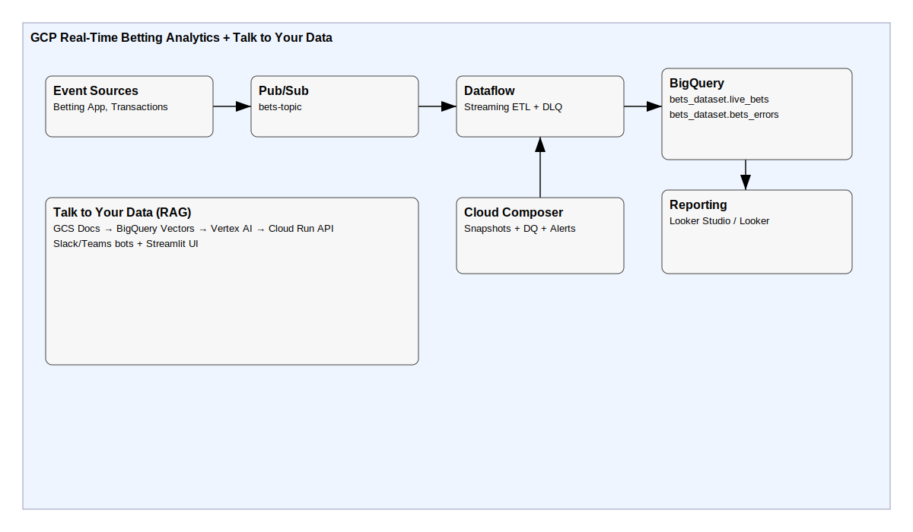

# Architecture Overview

**Layers**
- Ingestion: Pub/Sub
- Processing: Dataflow (Apache Beam)
- Orchestration: Cloud Composer (Airflow)
- Storage: BigQuery (partitioned & clustered), GCS
- Reporting: Looker Studio / Looker
- AI Access: Talk to Your Data (RAG) via Cloud Run + Vertex AI
